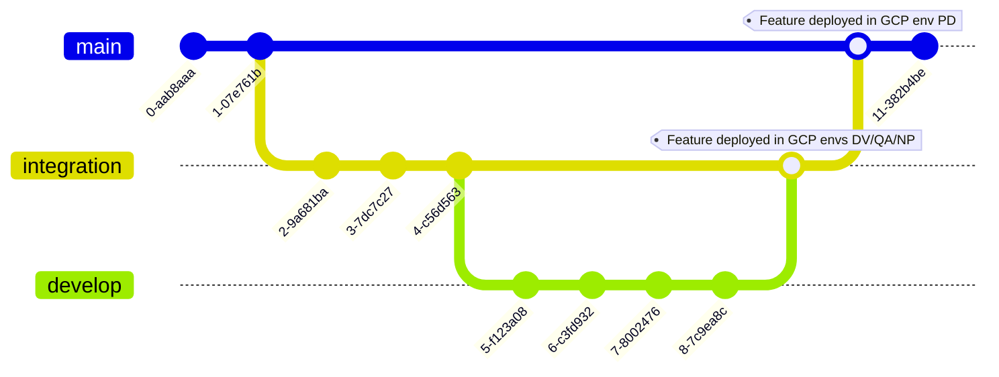

# {{cookiecutter.use_case_title}}

{{cookiecutter.use_case_short_description}}

**!** This project uses Git Flow and not Git Lab Flow. (See "How to contribute" part) **!**

[Dataform](https://cloud.google.com/dataform/docs/overview) is used for data transformations.

[Confluence link](https://confluence.e-loreal.com/pages/viewpage.action?pageId=462782840).

## Repository Structure

  - **config/**           : Usecase configuration files
  - **dataform.json**     : Dataform configuration file
  - **definitions/**      : Dataform folder that contains the SQL queries definitions
  - **iac/deploy-steps/** : Used by the CI/CD pipeline to deploy the infrastructure and the access management
  - **iac/deploy-steps/vars** : tf vars files. To be filled with your use case details.
  - **iac/modules/**      : Terraform sub-modules (contains the main 'usecase' module and init module)

## Branching model

- **main**: Main branch, represents the production environment
- **integration**: Integration branch, represents the non-production environments (np/qa/dv)

Cloud Build will perform the following actions when a branch is merged: Terraform plan on infra, Terraform apply on infra, Dataform run, Terraform plan on access management, Terraform apply on access management. Infra is all your Terraform code except access management. More details on build workflow in the Confluence page.

## How to contribute

- Each new feature should be created on a dedicated feature branch 'feature/[feature_name]' or 'develop' derived from the 'integration' branch.
- Once the feature is ready, it is merged on the 'integration' branch through a Pull Request.
- Release to the GCP 'dv' and 'np' environments is achieved by merging the feature branch on the 'integration' branch through a Pull Request
- Release to the 'pd' environment is achieved by merging the 'integration' branch on the 'main' branch through a Pull Request





## Usage

## PART 1 : Project CI/CD Initialization

### Step 1. Create new repository

You can create a new GitHub repository by using this repository as a template.

### Step 2. Manual setup of your project + CI/CD pipeline

In a new project, you must perform manual steps.

#### Initialization (To do for each environment)

* [ ] Fill the `config/general.yaml` and the `dataform.json` file with your use case details.

* [ ] Fill the `iac/deploy-steps/vars/backend` and `iac/deploy-steps/vars/tfvars` folders files with your use case details for all envs.

* [ ] Comment your use case module in `iac/deploy-steps/1.infra/main.tf` file (i.e. comment all modules except the 'init' one).

* [ ] Authorize your default Cloud Build service account, usually named as `[project_number]@cloudbuild.gserviceaccount.com`, with the role `virtual/deploy_sa` using the iam-manager repository (oneshot).

* [ ] Create a manual trigger on Cloud Build choosing the cloudbuild-init.yaml file in the root of the repository. This trigger must use the cloud build default service account. Choose `_INIT=true`, as a cloud build env variable to create the Cloud Storage for the tfstate. Also set `_APPLY_CHANGES=true` and `_ENV` to `dv, qa, np or pd`. Then, run the build.

* [ ] De-authorize your default Cloud Build service account from the `virtual/deploy_sa` role using the iam-manager repository (oneshotremoval).

* [ ] The new service account created for Cloud Build is `[usecase]-sa-cloudbuild-[env]@[project_id].iam.gserviceaccount.com`. This service account must have `virtual/deploy_sa` role. Use the iam-manager repository.

```yaml
{{cookiecutter.gcp_project_id[:-3]}}-dv:
  - "serviceAccount:{{cookiecutter.use_case}}-sa-cloudbuild-dv@{{cookiecutter.gcp_project_id[:-3]}}-dv.iam.gserviceaccount.com":
    - "virtual/deploy_sa"
```

* [ ] Update the created secret for Terraform in the Secret Manager GCP service. You should fill the secret with a Terraform cloud API key (Steps to follow in the [Developers Toolbox​](https://loreal.sharepoint.com/:p:/r/sites/-FR-EMEA-GoogleCloudPlatform/Documents%20partages/Platform/GCP/EMEA%20GCP%20-%20Developper%20Toolbox.pptx?d=w93537f07d88c4728ac12d56e88e55ad1&csf=1&web=1&e=jPQJXg)).

* [ ] You can now uncomment the other modules. You can trigger the CI/CD pipeline normally since the previous parts automatically created the git flow cloud build triggers. These triggers are using the `[usecase]-sa-cloudbuild-[env]@[project_id].iam.gserviceaccount.com` service account.

* [ ] The Cloud Build may fail; this is expected behavior. Before failing, the Cloud Build will have instantiated the Secret Manager for Dataform. You should fill the secret with an SSH private key (Steps to follow [Here](https://confluence.e-loreal.com/display/EMEADTF/Use+SSH+to+connect+Dataform+to+GitHub), starting at 'Create public and private SSH keys' part). Retry the Cloud Build after that.

* [ ] Other additional roles are needed for the project to work. Here are the roles to add using the iam-manager repository (oneshot):

```yaml
{{cookiecutter.gcp_project_id[:-3]}}-dv:
  - "serviceAccount:{{cookiecutter.use_case}}-sa-dataform-dv@{{cookiecutter.gcp_project_id[:-3]}}-dv.iam.gserviceaccount.com":
    - "roles/bigquery.admin"

{{cookiecutter.gcp_project_id[:-3]}}-dv:
  - "serviceAccount:dataform-executor-{{cookiecutter.use_case}}@{{cookiecutter.gcp_project_id[:-3]}}-dv.iam.gserviceaccount.com":
    - "roles/workflows.invoker"
```

### Step 3. IAM permission details

Some permissions need to be granted to service accounts in order the Dataform infrastructure works properly.

All transformations on BigQuery performed by Dataform will be executed using this service account: `[USECASE]-sa-dataform-[ENV]@[PROJECT-NAME].iam.gserviceaccount.com`.

* The Dataform service account `[USECASE]-sa-dataform-[ENV]@[PROJECT-NAME].iam.gserviceaccount.com` must have :
  - roles/bigquery.dataEditor on projects to which Dataform needs both read and write access.
  - roles/bigquery.jobUser on the project hosting your Dataform repository.
  - roles/bigquery.dataViewer on projects to which Dataform needs read only access.
  - More informations [here](https://cloud.google.com/dataform/docs/required-access?hl=fr).

* An advice is to give permission 'roles/dataform.editor' to the group 'emea-gcp-builders@loreal.com' ONLY in the dv project in order to be able to modify the SQL queries directly in the GCP console.

*  The service account "dataform-exec-[usecase]@[project_id].iam.gserviceaccount.com" must have (only if variable is_iam_admin is set to false in the dataform_provider.tf file):
    - roles/workflows.invoker on the project hosting your Dataform repository.
    - roles/dataform.editor on the project hosting your Dataform repository.

### Install Cloud SDK
See official documentation:
> https://cloud.google.com/sdk/docs/install
### Install Terraform
See official documentation:
> https://www.terraform.io/downloads.html

### Generate Application Default Credentials
Run the following command to generate an ADC used by the Terraform google provider:

`> gcloud auth application-default login`

All calls to Google Cloud APIs will be authenticated with the account used to generate the ADC.

### Move to an environment directory
`> cd iac/environments/dv`


## Pre-commit

Pre-commit will run various checks each time you commit changes to a local branch. Some hooks will try to automatically fix some issues by directly modifying the affected files. If changes were applied to any the file, the commit is cancelled so you can review those changes. You can then stage the changes to take them into account, and run the commit again.
### Install pre-commit
See official documentation: https://pre-commit.com/#install
### Setup git hook scripts
In order to setup git hooks, run the following command once at the root of the repo: `pre-commit install`
### Skip hooks during a commit
To disable all hooks for a commit, add the `--no-verify` flag to your commit command:

```
git commit -m "some changes" --no-verify
```

To only skip specific hooks, use the `SKIP` environment variable:
```
SKIP=sqlfluff-lint,sqlfluff-fix git commit -m "some changes"
```
